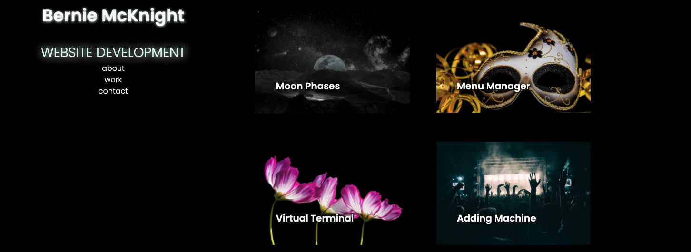

# personal-portfolio

[Live Demo](https://sissyhanks.github.io/personal-portfolio/)

## Description

Beyond a space to store and share my work, this portfolio is an example of how I execute the tools I've acquired and techniques I've learned.

From the work I have put in on this project I have gained a deeper understanding of how to order and group elements and how styling elements play upon them depending on their structure.

I've also begun to develop a system to organizing a project and approaching work flow that centers the idea that items on every scale myst be taken into account when making decisions.

## Features

### Responsive Design

The mobile first design displays all elements in a single column for scrolling through on smaller devices.

When the site is displayed on screens that are at least 768px wide, content boxes below the featured image are set to wrap.

For screens larger than 992px the header sticks to the left side and content scrolls along the right.

### Dynamic Header and Navigation

All screen sizes feature opaque header and navigation bars behind which content seems to disappear.

On larger screens, where users will likely be using a mouse, navigation items glow when the curser hovers over top.

